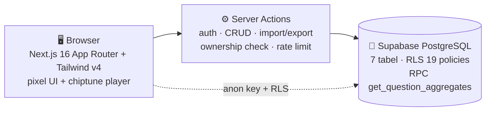

# 🎮 Kuis-Kuy — Survey Platform Tematik RPG

**Isi kuesioner rasanya kayak main game SNES. Boring surveys → quest seru 8-bit.**

---

## ❌ Masalahnya

- Survey itu **membosankan** → response rate rendah, data yang masuk sedikit
- Platform survey populer mahal & kaku, tidak ada yang menghibur responden
- Bagi pembuat survey: mengelola pertanyaan, hasil, dan ekspor biasanya butuh beberapa tool terpisah

## ✅ Kuis-Kuy

Survey platform **multi-tenant bertema RPG 8-bit** — pixel art, chiptune BGM, quest board, HP bar, dialogue box. Pembuat survey jadi "Guild Master", responden jadi "Adventurer" yang menyelesaikan quest.

### ✨ Fitur

**Untuk responden**
- 🗺️ **Quest Board** — daftar survey aktif seperti papan quest RPG
- 🎭 **Dialogue box** — pertanyaan tampil seperti percakapan NPC; rating 1–5 berbentuk diamond, pilihan gaya menu RPG
- 🎵 **Chiptune BGM** — 6 track, autoplay, tersimpan preferensinya
- 📊 **Hasil publik** — statistik agregat real-time (Bar/Pie/Trend chart)
- 🌗 Dark/light mode, autosave draft, responsif mobile

**Untuk pembuat survey**
- 🛠️ **Builder drag-and-drop** — tambah/edit/hapus/reorder pertanyaan
- 📥 **Import JSON/CSV/Excel** + template unduhan
- 👤 **Multi-tenant** — akun user + kepemilikan survey (edit/hapus/toggle milik sendiri)
- 📤 **Export CSV** (BOM-encoded, aman dibuka Excel)
- 🧑‍💼 **Admin dashboard** — statistik kartu, pagination, panel laporan, badge jumlah report

---

## 🏗️ Arsitektur

### 🛡️ Security (berlapis)

| Layer | Implementasi |
|---|---|
| User auth | JWT HMAC-SHA256, httpOnly signed cookie, 7 hari |
| Admin auth | middleware cookie check vs `ADMIN_PASSWORD` |
| Kepemilikan | cek owner/admin di setiap mutasi survey |
| Rate limit | per-IP 10 submit/menit + 5 report/menit |
| Anti-bot | honeypot field + max 2000 char/jawaban |
| Password | `crypto.scrypt` + salt acak |
| Database | Row Level Security 19 policies + RPC agregasi |

- **Stack:** Next.js 16 (App Router) · TypeScript strict · Tailwind CSS v4 · Supabase (PostgreSQL) · Recharts · Framer Motion · Vitest
- **Status:** production-ready — 40+ item checklist internal lengkap 100%

---

## 🔒 Tentang Source Code

Repository ini adalah **showcase** — dokumentasi produk, bukan kode sumber.
Source code Kuis-Kuy tidak dipublikasikan dan semua hak dilindungi. Lihat [`LICENSE`](LICENSE).

> 💬 Demo, kolaborasi, atau lisensi? Hubungi [Kandar Lubis](https://github.com/kandarlubis31).

---

© 2026 Kandar Lubis — All Rights Reserved.
